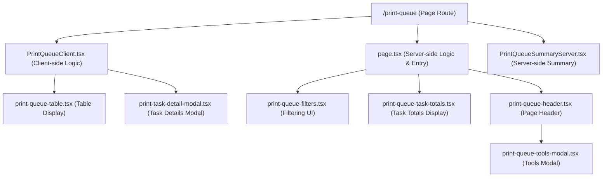
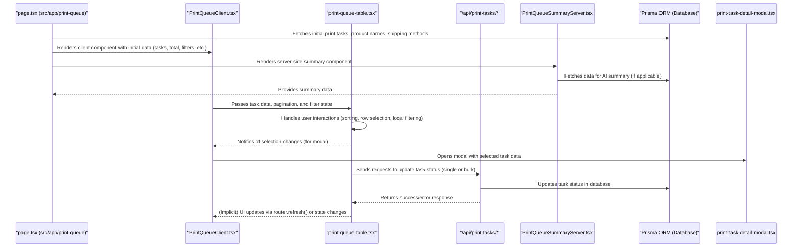

# Print Queue Architecture Overview

Based on the analysis of the `print-queue` directory and related files, here's the architecture overview:

## 1. Component Hierarchy



**Description:**

- The main page route is [`/print-queue`](src/app/print-queue/page.tsx:1).
- [`PrintQueueClient.tsx`](src/app/print-queue/PrintQueueClient.tsx:1) handles most of the client-side interactions and state management for the print queue page.
- [`page.tsx`](src/app/print-queue/page.tsx:1) (at `src/app/print-queue/page.tsx`) serves as the entry point, handling initial data fetching and server-side logic.
- [`PrintQueueSummaryServer.tsx`](src/app/print-queue/PrintQueueSummaryServer.tsx:1) is responsible for generating and displaying a summary of the print queue, likely involving AI processing.
- [`print-queue-table.tsx`](src/components/print-queue-table.tsx:1) is a crucial component for displaying the print tasks in a sortable, filterable table.
- [`print-task-detail-modal.tsx`](src/components/print-task-detail-modal.tsx:1) shows detailed information for a selected print task.
- Various UI components like [`print-queue-filters.tsx`](src/components/print-queue-filters.tsx:1), [`print-queue-task-totals.tsx`](src/components/print-queue-task-totals.tsx:1), and [`print-queue-header.tsx`](src/components/print-queue-header.tsx:1) contribute to the overall page structure and functionality.

## 2. Data Flow



**Description:**

- The [`page.tsx`](src/app/print-queue/page.tsx:1) at `src/app/print-queue/` fetches initial data (tasks, distinct product names, shipping methods) from the database via Prisma.
- This data is passed to [`PrintQueueClient.tsx`](src/app/print-queue/PrintQueueClient.tsx:1), which manages the client-side state and renders the main UI, including the [`PrintQueueTable`](src/components/print-queue-table.tsx:1).
- [`PrintQueueSummaryServer.tsx`](src/app/print-queue/PrintQueueSummaryServer.tsx:1) fetches its own data, potentially for AI-driven summaries, and is rendered server-side.
- The [`PrintQueueTable`](src/components/print-queue-table.tsx:1) handles user interactions like sorting, filtering (client-side aspects), and row selection.
- Status updates for tasks (single or bulk) are sent from the table component to API routes under [`/api/print-tasks`](src/app/api/print-tasks/route.ts:1). These API routes interact with the database via Prisma.
- After API operations, the UI is typically updated via `router.refresh()` to reflect changes.

## 3. Key Integration Points

- **API Routes:**
  - [`/api/print-tasks/[taskId]/status`](src/app/api/print-tasks/[taskId]/status/route.ts:1): For updating the status of a single print task.
  - [`/api/print-tasks/bulk-status`](src/app/api/print-tasks/bulk-status/route.ts:1): For updating the status of multiple print tasks.
  - Other routes under `/api/print-tasks/` for fetching tasks, optimizing, etc.
- **Context Providers:**
  - [`PrintQueueModalContext`](src/contexts/PrintQueueModalContext.tsx:1): Manages the state for the print task detail modal (visibility, selected task).
- **Shared Types:**
  - [`ClientPrintTaskData`](src/types/print-tasks.ts:1) (defined in `src/types/print-tasks.ts`): Ensures consistent data structure between server and client components for print tasks.
- **Utility/Action Functions:**
  - [`getPrintTasks`](src/app/print-queue/page.tsx:102) (in `src/app/print-queue/page.tsx`): Core function for fetching and filtering print tasks.
  - [`updateTaskStatus`](src/components/print-queue-table.tsx:86), [`bulkUpdateTaskStatus`](src/components/print-queue-table.tsx:109) (in `src/components/print-queue-table.tsx`): Client-side functions to call the respective APIs.
  - [`fixInvalidStlRenderStatus`](src/lib/order-processing.ts:1) (in `lib/order-processing.ts`): A utility run on page load to correct data inconsistencies.
  - Functions in [`lib/actions/print-queue-actions.ts`](src/lib/actions/print-queue-actions.ts:1) for server-side actions related to the print queue.

## 4. Styling and UI Logic

- **Marketplace & Color Styling:**
  ```mermaid
  classDiagram
      class PrintQueueTable {
          +getShippingAlias(originalName) string
          +getMarketplaceAlias(originalName) string
          +getColorInfo(colorName) object
          +marketplaceStyles: Record~string, object~
          +shippingMapping: Record~string, string~
          +marketplaceMapping: Record~string, string~
          +colorMapInternal: Record~string, object~
      }
      Note for PrintQueueTable : "Located in src/components/print-queue-table.tsx"
  ```
  - The [`PrintQueueTable`](src/components/print-queue-table.tsx:1) component contains logic for:
    - Mapping raw shipping service names and marketplace names to user-friendly aliases (e.g., `getShippingAlias`, `getMarketplaceAlias`).
    - Applying specific background and text colors for different marketplaces and product colors using `getColorInfo` and predefined mappings like `marketplaceStyles` and `colorMapInternal`.
- **Status and Priority Styling:**

  ```mermaid
  classDiagram
      class PrintQueueTable_RowStyling {
          +applyInProgressLineThrough()
          +applyPriorityBorderSpecialDelivery()
          +applyPriorityBorderTracked24()
      }
      PrintQueueTable_RowStyling --|> PrintQueueTable : "Extends styling of"
      Note for PrintQueueTable_RowStyling : "CSS rules within print-queue-table.tsx"

  ```

  - CSS rules within [`print-queue-table.tsx`](src/components/print-queue-table.tsx:1) (e.g., `.in-progress-row`, `.priority-special-delivery`) are used to:
    - Apply a line-through style to text in rows for tasks that are "in_progress".
    - Add distinct visual indicators (like left borders) for tasks with priority shipping methods (e.g., Special Delivery, Tracked24).

## 5. Modularity and Separation of Concerns

The architecture demonstrates good modularity:

- **Server vs. Client Components:** Clear separation with `page.tsx` (server) and `PrintQueueClient.tsx` (client).
- **Reusable UI Components:** Components like `PrintQueueTable`, `PrintQueueFilters`, `PrintTaskDetailModal` are well-defined and could potentially be reused.
- **Utility Functions:** Logic for data transformation, API calls, and specific business rules are often encapsulated in functions within `/lib` or as static/helper functions within components.
- **Type Safety:** Use of TypeScript and shared types (e.g., `ClientPrintTaskData`) helps maintain consistency.
- **API Abstraction:** Data operations are handled through dedicated API routes, decoupling frontend logic from direct database access.
- **Context for Shared State:** `PrintQueueModalContext` is used for managing modal state, avoiding prop drilling.

This structure promotes maintainability and scalability by isolating responsibilities and ensuring clear data flows.

Area	File(s)
Page entry & server logic	src/app/print-queue/page.tsx
src/app/print-queue/PrintQueueClient.tsx
src/app/print-queue/PrintQueueSummaryServer.tsx
UI components (client-side)	src/components/print-queue-table.tsx
src/components/print-task-detail-modal.tsx
src/components/print-queue-filters.tsx
src/components/print-queue-task-totals.tsx
src/components/print-queue-header.tsx
src/components/print-queue-tools-modal.tsx
Shared context & types	src/contexts/PrintQueueModalContext.tsx
src/types/print-tasks.ts
Business logic / utilities	src/lib/order-processing.ts
src/lib/actions/print-queue-actions.ts
API routes that mutate or supply data	src/app/api/print-tasks/route.ts (“list” endpoint, if present)
src/app/api/print-tasks/[taskId]/status/route.ts
src/app/api/print-tasks/bulk-status/route.ts
…plus any other /api/print-tasks/* routes you actually call from the UI
Styling & build config <span style="font-size:0.9rem">(helps the reviewer comment on look-and-feel and performance)</span>	tailwind.config.js
postcss.config.js
src/styles/globals.css (or the equivalent global stylesheet)
Project metadata	package.json
tsconfig.json

Tip: If you have component-specific CSS/SCSS modules, include them too; otherwise the reviewer can’t see the actual visuals you’re shipping.
Avoid zip bombs: keep large asset folders (e.g. STL files, test fixtures) out unless a file is directly referenced by the code under review.

B. Prompt template for a deep-dive code review, with an emphasis on UI
text
Copy
Edit
You are a senior full-stack engineer with a strong eye for modern React/Next.js UI and UX.  
Below is the complete source of my “Print Queue” feature from a Next 14 App-Router project (TypeScript + Tailwind).  
**Please review it exhaustively and suggest improvements at every level.**

#### Goals
1. **Architecture & maintainability** – spot unnecessary complexity, missing abstraction layers, dead code, or tight coupling between server and client components.
2. **Performance** – comment on data-fetching patterns (SSR/CSR/ISR), table rendering (virtualisation, pagination), and potential bottlenecks in API calls or Prisma queries.
3. **Type safety & correctness** – flag any risky `any` usage, silent catches, or assumptions that could break at runtime.
4. **Accessibility & UI/UX polish** – evaluate keyboard navigation, ARIA roles, colour contrast, responsive behaviour, loading states, and general usability of modals/tables/filters.
5. **Visual design consistency** – suggest Tailwind utility clean-ups, helper classes, theme tokens, or component-library extraction to keep design language consistent.
6. **Error handling & DX** – review how errors are surfaced to users and logged for developers; highlight spots where Zod or tRPC’s error maps would help.
7. **Testing strategy** – propose unit/E2E tests that give the best ROI for this feature.

#### Deliverables
- A **high-level summary** of the most critical issues and quick wins.
- A **file-by-file walkthrough** listing:
  - Purpose of the file in one sentence.
  - Specific lines or patterns that need attention (quote snippets).
  - Concrete refactor suggestions (with code examples where helpful).
- **UI/UX checklist** of improvements, grouped by accessibility, interaction design, and visual consistency.
- **Performance checklist** pointing to the exact query/component causing potential slow-downs.
- Recommended **tooling or libraries** (e.g. TanStack Table, React Aria, Zustand, React Query, Lighthouse CI) that would improve the codebase.
- Clearly separate **“must-fix”** blockers, **“should-fix”** items, and nice-to-haves.

#### Context files included
<insert list exactly as attached>

Write your feedback in British English. Keep explanations concise but actionable, and back claims wit

Print Queue Feature Review
High-Level Summary
Critical Issues:

Tight coupling between UI and API logic in table component
Missing virtualization for large datasets
Inconsistent type definitions across components
Security risk in error handling exposing raw error messages
Quick Wins:

Extract color/status mapping to shared utility module
Add proper ARIA attributes for accessibility
Implement table virtualization
Add proper loading states for async operations
File-by-File Walkthrough
src/components/print-queue-table.tsx
Purpose: Main table UI component with status management and bulk actions

Issues:

Line 86-107: updateTaskStatus should use src/lib/api/secure-client.ts instead of raw fetch
Line 204-249: getColorInfo logic could be simplified with a more efficient lookup strategy
Line 1135-1137: Inline styles should be moved to CSS modules
Line 980-1049: Bulk action buttons need better visual feedback for loading states
Suggestions:

// Instead of raw fetch, use secure client
import { secureClient } from "@/lib/api/secure-client";

async function updateTaskStatus(taskId: number, status: PrintTaskStatus) {
  const response = await secureClient.patch(`/print-tasks/${taskId}/status`, { status });
  // ...rest of implementation
}

ts


UI/UX Checklist
Accessibility
[ ] Add aria-label to all status buttons
[ ] Ensure keyboard navigation works with dropdown menus
[ ] Add role="region" to table container
[ ] Implement proper focus management for modals
Interaction Design
[ ] Add confirmation dialog for bulk actions
[ ] Implement undo functionality for status changes
[ ] Add keyboard shortcuts for common actions
[ ] Improve loading state visual feedback
Visual Consistency
[ ] Create reusable status badge component
[ ] Standardize button variants in tailwind.config.js
[ ] Create consistent spacing tokens
[ ] Implement proper text truncation strategy
Performance Checklist
[ ] Implement virtualized table for >100 rows
[ ] Add caching to getColorInfo and getShippingAlias
[ ] Optimize Prisma queries in API routes to avoid N+1 issues
[ ] Implement Suspense for modal loading states
Recommended Tooling
TanStack Table - Already used but could benefit from column size plugin
React Aria - For better accessibility handling
Zod - For stricter API input v alidation
Playwright - For E2E testing of table interactions
Storybook - For component library development
Architecture Improvements
Create proper abstraction layer between UI and API
Move color/status mapping to shared config module
Implement proper error boundary structure
Add middleware for request validation
Consider Web Workers for heavy data processing
